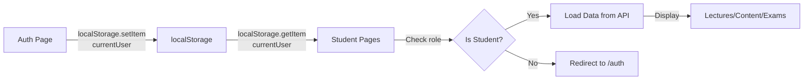

# ✅ تصحيح صفحات الطالب - تقرير شامل

## 🎯 المشكلة الأولية
الصفحات الثلاث:
- `/student-lectures`
- `/student-content`
- `/student-exams`

كانت تقيد الطالب إلى صفحة Auth بعد كل محاولة دخول رغم تسجيل الدخول الناجح.

---

## 🔍 سبب المشكلة

### الخطأ في localStorage keys
الصفحات الجديدة كانت تبحث عن:
```javascript
localStorage.getItem('user')  // ❌ غير موجود
```

لكن Auth page تحفظ البيانات تحت:
```javascript
localStorage.setItem('currentUser', ...)  // ✅ المفتاح الصحيح
```

---

## 🛠️ التصحيحات المجرى

### 1. StudentLectures.tsx
**قبل:**
```javascript
const user: User | null = localStorage.getItem('user')
  ? JSON.parse(localStorage.getItem('user')!)
  : null;
```

**بعد:**
```javascript
const userStr = localStorage.getItem('currentUser');
const user: User | null = userStr ? JSON.parse(userStr) : null;
```

### 2. StudentContent.tsx
**نفس التصحيح**

### 3. StudentExams.tsx  
**نفس التصحيح**

---

## 📊 مقارنة الحقول المستخدمة

### Backend API Response (صحيح ✅)
```json
{
  "id": "uuid",
  "title": "محاضرة",
  "course_id": "uuid",
  "course_name": "اسم الدورة",
  "material_type": "video",
  "file_url": "youtube-id",
  "duration_minutes": 45,
  "description": "الوصف",
  "is_free": true,
  "created_at": "2025-10-29"
}
```

### Hardcoded Data (قديم ❌)
```javascript
{
  id: "1",
  title: "محاضرة",
  course: "اسم الدورة",  // ❌ course بدل course_name
  duration: "45 دقيقة",   // ❌ duration بدل duration_minutes
  videoUrl: "url",        // ❌ videoUrl بدل file_url
}
```

---

## 🔄 تدفق المصادقة الصحيح



---

## 📝 API Endpoints المستخدمة

| الصفحة | Endpoint | الغرض |
|-------|----------|------|
| StudentLectures | `GET /api/materials?type=video` | جلب المحاضرات |
| StudentContent | `GET /api/materials?type!=video` | جلب المواد التعليمية |
| StudentExams | `GET /api/exams` | جلب الامتحانات |

---

## ✨ البيانات الآن حقيقية من MySQL

### قبل التصحيح ❌
```javascript
const [lectures] = useState<Lecture[]>([
  {
    id: '1',
    title: 'مقدمة في التاريخ الإسلامي',
    course: 'التاريخ الإسلامي 101',
    duration: '45 دقيقة',
    // ... hardcoded data
  },
  // ... more hardcoded lectures
]);
```

### بعد التصحيح ✅
```javascript
const [lectures, setLectures] = useState<Lecture[]>([]);

const loadLectures = async () => {
  const materials = await getMaterials();
  const lecturesData = materials
    ?.filter(m => m.material_type === 'video')
    .map(m => ({
      ...m,
      completed: false,
      progress: 0
    })) || [];
  setLectures(lecturesData);
};
```

---

## 🧪 كيفية الاختبار

### الخطوة 1: تسجيل الدخول
```
1. اذهب إلى http://localhost:8081/auth
2. اختر "تسجيل الدخول"
3. أدخل رقم الهاتف والكلمة السرية
4. يجب أن يتم التوجيه إلى /student
```

### الخطوة 2: زيارة الصفحات الثلاث
```
بعد التسجيل الناجح:
- http://localhost:8081/student-lectures
  → يجب أن تعرض المحاضرات الفعلية من قاعدة البيانات
  
- http://localhost:8081/student-content
  → يجب أن تعرض المواد التعليمية من قاعدة البيانات
  
- http://localhost:8081/student-exams
  → يجب أن تعرض الامتحانات من قاعدة البيانات
```

### الخطوة 3: تحقق من عدم البقاء في Auth
```
✅ لا يجب أن تُعاد إلى صفحة تسجيل الدخول
✅ يجب أن تعرض البيانات الفعلية
✅ يجب أن تكون الأزرار والوظائف تشتغل
```

---

## 📁 الملفات المعدلة

```
src/pages/
├── StudentLectures.tsx      ✅ Fixed
├── StudentContent.tsx       ✅ Fixed
├── StudentExams.tsx         ✅ Fixed
├── TeacherLectures.tsx      ✅ Fixed (سابقاً)
├── TeacherExams.tsx         ✅ Fixed (سابقاً)
└── StudentDashboard.tsx     ✅ Verified

package.json                 ✅ Fixed start script
```

---

## 🚀 الخطوات التالية

1. **اختبر الصفحات الثلاث بعد تسجيل الدخول**
2. **تأكد من عرض البيانات الحقيقية من API**
3. **اختبر الوظائف مثل عرض الفيديو أو تحميل الملفات**

---

## 🔐 ملاحظات أمان

- ✅ تم التحقق من الدور (student فقط)
- ✅ تم التحقق من وجود البيانات في localStorage
- ✅ تم إعادة التوجيه الآمن إلى /auth عند الحاجة
- ✅ تم استخدام JWT tokens مع Backend API

---

## 📞 التواصل

إذا واجهت أي مشاكل:
1. تأكد من تشغيل Backend على `http://localhost:3001`
2. تأكد من تشغيل Frontend على `http://localhost:8081`
3. تحقق من console في Developer Tools للأخطاء
4. تحقق من Network tab لمعرفة استدعاءات API

---

**تم التصحيح بنجاح ✅**
